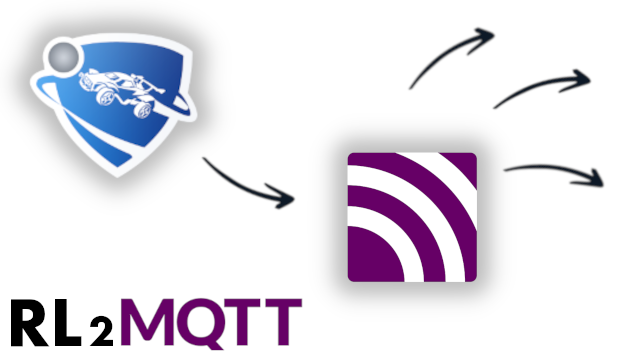

<picture>
  <source media="(prefers-color-scheme: dark)" srcset="assets/rl2mqtt_dark.png">
  <source media="(prefers-color-scheme: light)" srcset="assets/rl2mqtt_light.png">
  
</picture>

Connect your Rocket League to an MQTT broker. Game events and ticker messages wil be 
published as json messages. Use these messages in whatever tool you like to do whatever 
you want. Change lights using node-red and/or home-assistant. Trigger actions in OBS-Studio 
or activate a soundboard on your discord server.

## Installation

There are a few ways to install this plugin. From within Rocket League you can use the 
plugin manager and use ID _604_ to install this plugin. On the 
[Bakkesmod page of this plugin](https://bakkesplugins.com/plugins/view/604) you can install 
the plugin using the button or download the zip file. The latest release zipfile can also be 
downloaded from Github. Bakkesmod will always be verified by the bakkesmod team, but might 
be a few versions behind the Github release.

## Configuration

There are two ways to configure this plugin. Using the plugin GUI and using the console.

### GUI

When you open the Bakkesmod screen (F2), there is a settings page in the plugin manager.


### Console

Configuration can also be done in the console (F6). Change server settings using
`rl2mqtt_server "mqtt://localhost:1883"`. When you use a standard port without SSL, only 
an IP address is enough. Optionaly you can also configure a username and password with 
`rl2mqtt_username "user"` and `rl2mqtt_password "password"` when nescesary.

To connect use `rl2mqtt_connect` and to disconnect `rl2mqtt_disconnect`. You can automatically 
connect on startup by setting `rl2mqtt_connect_on_startup 1`.

If you only want to send Stat messages, use `rl2mqtt_message_types 1`, otherwise keep it
on `rl2mqtt_message_types 0`.


## Game event messages

Game events are hooks in the game which trigger a message on certain events. THe message 
will contain all the teams and players in the current match. Gamne event messages are 
published in `"rl2mqtt/gameevent"`.

### Example of game event message
```json
{
    "gameEvent":"Function GameEvent_Soccar_TA.Active.StartRound",
    "matchGUID":"C76862A211F08C338A293793E8FBC013",
    "teams":[{
        "clubId":0,
        "homeTeam":true,
        "index":0,
        "name":"Team",
        "num":0,
        "players":[{
            "club":{
                "accentColor":{"B":0,"G":178,"R":0},
                "id":99999,
                "name":"CLUBNAME",
                "primaryColor":{"B":38,"G":38,"R":38},
                "tag":"TAG"
            },
            "id":"Epic|12345|0",
            "name":"Janoz",
            "score": 123

        },{
            "id":"Unknown|0|0",
            "name":"Buzz",
            "score": 123
        },{
            "id":"Unknown|0|0",
            "name":"Iceman",
            "score": 123
        }],
        "primaryColor":{"B":255,"G":115,"R":24},
        "score":0,
        "secondaryColor":{"B":229,"G":229,"R":229}
    },{
        "clubId":0,
        "homeTeam":false,
        "index":1,
        "name":"Team",
        "num":1,
        "players":[{
            "id":"Unknown|0|0",
            "name":"Centice",
            "score": 123
        },{
            "id":"Unknown|0|0",
            "name":"Gerwin",
            "score": 123
        },{
            "id":"Unknown|0|0",
            "name":"Imp",
            "score": 123
        }],
        "primaryColor":{"B":24,"G":100,"R":194},
        "score":0,
        "secondaryColor":{"B":229,"G":229,"R":229}
    }]
}
```

Curently the following hooks are supported:

* TAGame.GameEvent_TA.EventPlayerAdded
* TAGame.GameEvent_TA.EventPlayerRemoved
* TAGame.GameEvent_Soccar_TA.OnAllTeamsCreated
* GameEvent_Soccar_TA.Active.StartRound
* TAGame.GameEvent_Soccar_TA.OnOvertimeUpdate
* TAGame.GameEvent_Soccar_TA.Destroyed
* TAGame.GameEvent_Soccar_TA.EventMatchEnded

## Stat messages

Rocket League also publishes stat events messages. Those events are divided into two categories:

### StatTickerMessages

Ticker messages are messages which would normally be displayed in the upper right 
corner. The JSON message consists of the player and the tickerEvent. In case of a 
"Demolish" it will also contain the victim. These messages are published in `rl2mqtt/ticker`.

### Example of a ticker json message:

```json
{
    "event":"Demolish",
    "matchGUID":"C76862A211F08C338A293793E8FBC013",
    "player":{
        "club":{
            "accentColor":{"B":0,"G":178,"R":0},
            "id":99999,
            "name":"CLUBNAME",
            "primaryColor":{"B":38,"G":38,"R":38},
            "tag":"TAG"
        },
        "id":"Epic|12345|0",
        "name":"Janoz",
        "score": 234,
        "team":{
            "clubId":0,
            "homeTeam":true,
            "index":0,
            "name":"Team",
            "num":0,
            "primaryColor":{"B":255,"G":115,"R":24},
            "score":0,
            "secondaryColor":{"B":229,"G":229,"R":229}
        }
    },
    "victim":{
        "id":"Unknown|0|0",
        "name":"Imp",
        "score": 345,
        "team":{
            "clubId":0,
            "homeTeam":false,
            "index":1,
            "name":"Team",
            "num":1,
            "primaryColor":{"B":24,"G":100,"R":194},
            "score":0,
            "secondaryColor":{"B":229,"G":229,"R":229}
        }
    }
}
```

### StatEvent
 
Stat events are messages which normaly popup fullscreen for the current player. These 
are things like "Clear Ball" or "First Touch". Only the stats of the primary local player 
are published. The json message has the same format as StatTickerMessages, but the player 
is always the primary local player. In case of a demolishion there is also no victim. There 
is also a lot of overlap between these messahes and the StatTickerMessages. If the local 
player does a shot on goal, two messages are published. A ticker and a stat message. Stat 
events are published in `rl2mqtt/stat`


### Eventnames

The following list is copied [from the Bakkesmod site](https://wiki.bakkesplugins.com/functions/stat_events/). 
It's a complete list of Events. Some are StatEvents, some are TickerMessages, some are both.

* Demolish
* Demolition
* Goal
* Win
* MVP
* AerialGoal
* BackwardsGoal
* BicycleGoal
* LongGoal
* TurtleGoal
* PoolShot
* OvertimeGoal
* HatTrick
* Assist
* Playmaker
* Save
* EpicSave
* Savior
* Shot
* Center
* Clear
* FirstTouch
* BreakoutDamage
* BreakoutDamageLarge
* LowFive
* HighFive
* HoopsSwishGoal
* BicycleHit
* OwnGoal
* KO_Winner
* KO_Knockout
* KO_DoubleKO
* KO_TripleKO
* KO_Death
* KO_LightHit
* KO_HeavyHit
* KO_AerialLightHit
* KO_AerialHeavyHit
* KO_HitTaken
* KO_BlockTaken
* KO_Grabbed
* KO_Thrown
* KO_LightBlock
* KO_HeavyBlock
* KO_PlayerGrabbed
* KO_PlayerThrown

## Game Time

The total seconds remaining is published in `rl2mqtt/gametime`.

### Example of gametime message
```json
{
    "matchGUID":"C76862A211F08C338A293793E8FBC013",
    "remaining" : 300
    "overtime" : false
}
```
Time remaining is in seconds. When a game goes into overtime, remaining starts counting up again.

# Usages

TODO

### Node-RED

TODO

### Home Assistant

TODO
